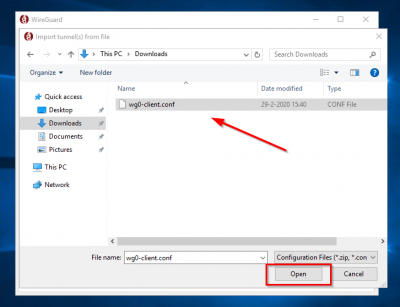

import { Steps } from '@astrojs/starlight/components';

## Config lementése

Miután sikeresen telepítetted a Wireguard klienst, nincs más dolgod, mint lementeni és aktiválni a configot.

<Steps>

1. Nyiss egy jegyzettömböt vagy egy tetszőleges kódszerkesztőt!

2. Másold be a korábban kapott configot! 

	"Fájl" --> "Mentés másként" vagy ctrl+s!

	A fájl típusánál legyen kiválasztva a "minden fájl", és mentsd el egy tetszőleges helyre, tetszőleges névvel, de figyelj, hogy a fájlnév végére írd oda, hogy .conf

	

</Steps>

## Config betöltése és aktiválása Wireguard-ban

<Steps>

1. Vedd elő a korábban feltelepített és megnyitott Wireguard klienst, majd választd ki a `Import tunnel(s) from file` lehetőséget!

	

2. Töltsd be az imént lementett fájlt!

	

3. Ezután még **nem** lesz aktív a VPN kapcsolat, kattints rá az `Activate` gombra!

	

4. Ha megjelenik a zöld pont, és az `Active` felirat, akkor már aktív is a VPN, az ablakot bezárhatod, és élvezheted a gyors netet! 😎

	

	

</Steps>
