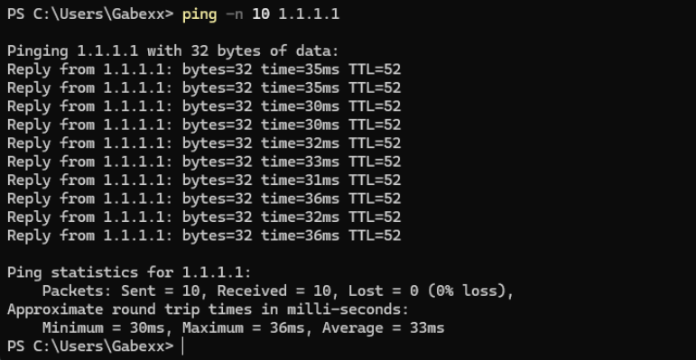
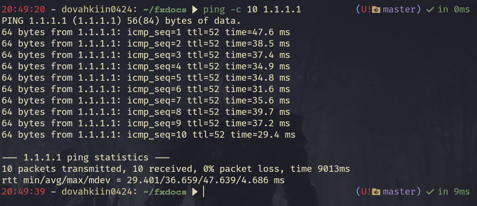
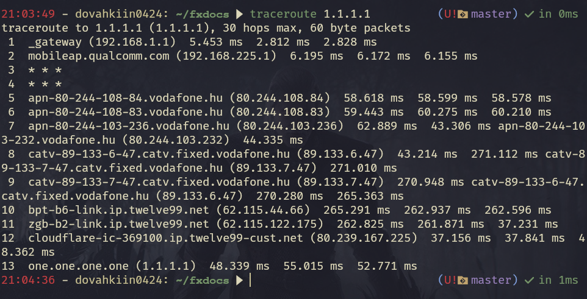

import { Steps, Aside, Tabs, TabItem } from '@astrojs/starlight/components';

## Alapvető hálózati hibakeresés

Előfordulhatnak olyan helyzetek, amikor szükségessé válik egy adott IP-cím vagy domain válaszidejének ellenőrzése, illetve annak vizsgálata, hogy milyen útvonalon jut el a forgalom a célzott szolgáltatáshoz.

<Aside>

Ez a tudás akkor is hasznos, ha ellenőrizni szeretnéd, hogy a VPN működik-e vagy kíváncsi vagy, hogy támogatjuk-e az adott szolgáltatást!

</Aside>

### Ping parancs

A válaszidőnek, illetve a csomagvesztésnek mérésének a legalapvetőbb módja a **ping**.

<Tabs syncKey="os">
  <TabItem label="Windows" icon="seti:windows">

    Az alábbi parancs a válaszidőt (ping), illetve a csomagvesztést (packet loss) méri a megadott ip cím felé 10 csomagon keresztül.

	```cmd 
	ping -n 10 1.1.1.1
	```

	

  </TabItem>
  <TabItem label="Linux" icon="linux">

	Az alábbi parancs a válaszidőt (ping), illetve a csomagvesztést (packet loss) méri a megadott ip cím/webcím felé 10 csomagon keresztül.

	```bash
	ping -c 10 1.1.1.1
	```

	

  </TabItem>
</Tabs>

### Tracert/Traceroute parancs

Mikor csatlakozol az internetre, valójában több szerveren mész keresztül, míg eléred uticélod, ezt az útvonalat hívjuk a gépedtől az uticélig **route**-nak. Ezen útvonal ismerete a mi szempontunkból kimondottan fontos, de sebaj, nagyon egyszerűen megtekinthető.


<Tabs syncKey="os">
  <TabItem label="Windows" icon="seti:windows">

	Az alábbi parancs megmutatja, hogy milyen utat jársz be, mielőtt eléred uticélod.

	```cmd
	tracert 1.1.1.1
	```

	

  </TabItem>
  <TabItem label="Linux" icon="linux">

	Az alábbi parancs megmutatja, hogy milyen utat jársz be, mielőtt eléred uticélod.

	```bash
	traceroute 1.1.1.1
	```

	

  </TabItem>
</Tabs>
